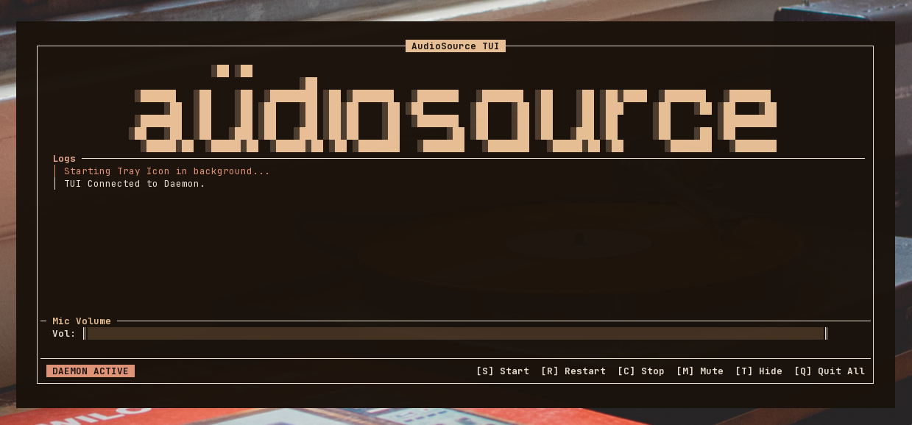

# Audio Source

> [!NOTE]
> **This is a fork** that adds a Terminal User Interface (TUI) and a System Tray icon for easier control of the application. It works directly with the official APK provided by the original creator, [gdzx](https://github.com/gdzx), without requiring you to install any custom or modified APK.



Audio Source forwards Android microphone audio input to the PulseAudio daemon
through ADB, so you can use your Android device as a USB microphone.


## Requirements

- Device with at least Android 4.0 (API level 14), but fully tested only on
  Android 10 (API level 29) so your mileage may vary.
- GNU/Linux machine with:
  - Android SDK Platform Tools (requires `adb` in `PATH`).
  - PulseAudio or PipeWire with PulseAudio support (requires `pactl` in
    `PATH`).
  - Python 3 (requires `python3` in `PATH`).

## Installation

[](https://f-droid.org/packages/fr.dzx.audiosource/)
[](https://github.com/gdzx/audiosource/releases/latest)

On your Android device:

1. Go to _Settings > About phone_ then tap _Build number_ 7 times to enable the
   _Developer options_ menu.
2. In _Settings > System > Developer options_ enable _USB debugging_ (Android
   Debug Bridge).
3. Install the Audio Source Android app:
   - (Recommended) Get it on [F-Droid](https://f-droid.org/packages/fr.dzx.audiosource/).
   - Or download the APK from the [latest release](https://github.com/gdzx/audiosource/releases/latest).
   - Or build it from source (see [Build and install](#build-and-install)).

On your Linux PC:

### Automatic Installation (Recommended)
You can download, extract, and launch the interactive installer automatically with a single command:
```console
$ curl -sSL https://raw.githubusercontent.com/ezequielgk/audiosource/main/install.sh | bash
```

### Manual Installation
1. Download the `audiosource-linux.tar.gz` Linux client from the [latest release](https://github.com/ezequielgk/audiosource/releases/latest).
2. Extract the archive and open a terminal inside the extracted directory.
3. Run the interactive installer:
   ```console
   $ ./install.sh
   ```
   *The installer provides a menu to resolve dependencies (requires sudo), install the app locally, or uninstall it.*

## Usage

### Desktop TUI & System Tray

Once installed, you can launch the application from your desktop's application menu (search for **Audio Source**) or directly from any terminal:

```console
$ audiosource
```
This automatically launches the system tray icon and connects the terminal interface to it.
2. **Interactive Controls:**
   - **`[S] Start`**: Starts the audio forwarding.
   - **`[C] Stop`**: Stops the audio forwarding.
   - **`[T] Hide to Tray`**: Closes the terminal interface but keeps the system tray daemon and audio forwarding running in the background.
   - **`[M] Mute/Unmute`**: Toggles microphone mute.
   - **`[Q] Quit All`**: Exits the terminal interface, shuts down the system tray daemon, and stops audio forwarding.

### Command Line Interface (CLI)

The installed `audiosource` command also supports special arguments:

- **Update App**: Automatically download and install the latest version from GitHub:
  ```console
  $ audiosource update
  ```

### Custom ASCII Art

You can personalize the TUI logo by replacing the default art:
- Edit the file at `~/.config/audiosource/ascii.txt` and paste your custom text. The TUI will automatically center it and adjust the layout seamlessly.
- Alternatively, use `~/.config/audiosource/config.json` with an `"ascii_art"` key.

## Troubleshooting

If you encounter the `adb not found` error, it means that the `adb` command is
either not installed or not in your system's `PATH`. On most distributions you
can install it via the package manager:

```console
# Arch Linux
$ pacman -S android-tools

# Debian/Ubuntu
$ apt install android-tools-adb
```

After installation, verify that it is working with `adb --version`, and re-run
`audiosource`.

Common tips:

- Ensure your phone is connected, USB debugging is enabled, and the PC is
  authorized (check your phone for a prompt to allow the connection).
- Run `adb devices` to confirm your phone is detected (it should show a serial
  number and "device").
- If no devices are found, try a different USB cable/port or try to re-enable
  USB debugging.

## Multi-device

If you have multiple devices connected then you will have to specify the serial
number of the device you would like to forward audio to. Device serial numbers
can be found by running `adb devices`. 

Then you can specify the serial number as an argument:

```console
$ ./audiosource -s 1234 run
```

Or by setting the `ANDROID_SERIAL` environment variable:

```console
$ ANDROID_SERIAL=1324 ./audiosource run
```

You can utilize job control to forward audio from multiple devices
simultaneously as follows:

```console
$ ./audiosource -s shiba run &  # press ENTER to regain control of your terminal
$ ./audiosource -s 192.168.1.188:39857 run
```

## Build and install

Run `./gradlew tasks` to list the available commands.

### Debug

```console
$ ./audiosource build
$ ./audiosource install
```

### Release

1. Generate a Java KeyStore:

   ```console
   $ keytool -keystore /home/user/android.jks -genkey -alias release \
          -keyalg RSA -keysize 2048 -validity 30000
   ```

2. Create `keystore.properties` in the project root directory containing:

   ```ini
   storeFile=/home/user/android.jks
   storePassword=STORE_PASS
   keyAlias=release
   keyPassword=KEY_PASS
   ```

3. Build and install:

   ```console
   $ export AUDIOSOURCE_PROFILE=release
   $ ./audiosource build
   $ ./audiosource install
   ```

## Acknowledgement

[sndcpy](https://github.com/rom1v/sndcpy) for the initial implementation of
audio playback forwarding.

## License

This project is licensed under the MIT license ([LICENSE](LICENSE) or
http://opensource.org/licenses/MIT).
